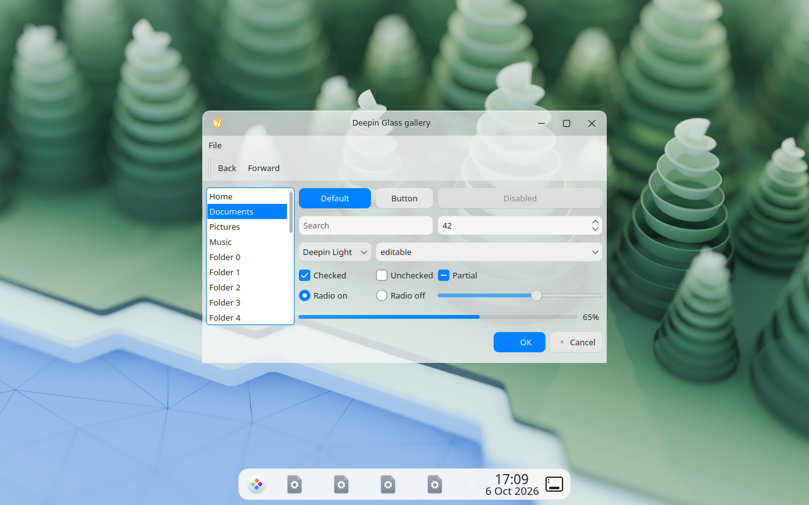
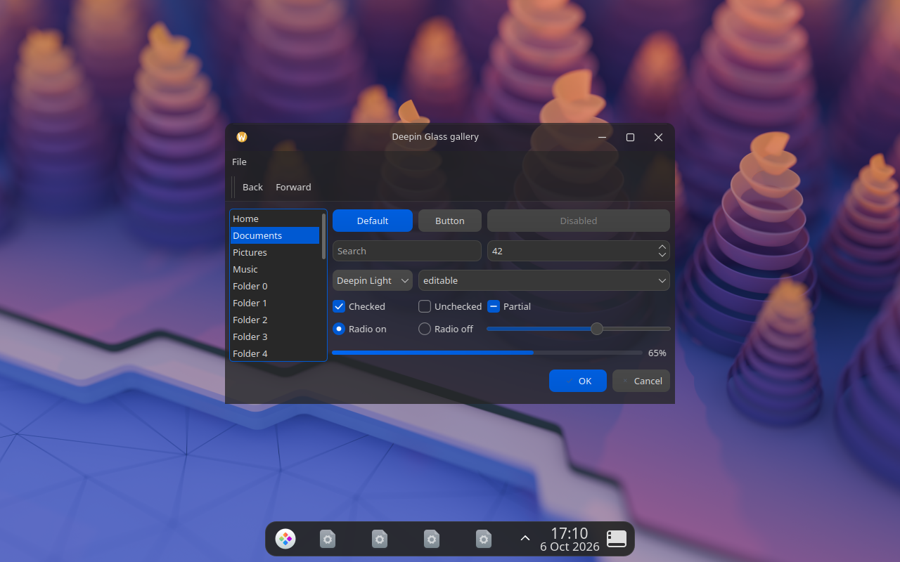

# plasma-deepin-theme

A global theme for **KDE Plasma 6** with the look and feel of the Deepin desktop:
frosted glass windows and dock that take on the colours of whatever is behind
them, DTK colours and radii, Deepin "bloom" icons and cursors, a matching login
screen and matching GTK 3/4 themes.




*Screenshots from a software-rendered test session: KWin composited with
QPainter there, so blur, window shadows and rounded bottom corners are not
visible. On real hardware (OpenGL compositing) the glass is blurred.*

This is an independent community project. It is not affiliated with or
endorsed by Deepin / UnionTech. "Deepin" is used only to describe the look.

## Components

| Component | Name | Distribution |
|---|---|---|
| Window decoration (C++, KDecoration3, blur, rounded corners) | **Deepin Glass** | AUR: `plasma-deepin-glass` / `plasma-deepin-glass-git` |
| Application style (C++, Qt 6, based on Breeze, translucent + blurred windows) | **Deepin Glass** | AUR (same package) |
| Colour schemes | Deepin Light, Deepin Dark | KDE Store |
| Plasma style (panel/dock, popups, tooltips; follows the colour scheme) | Deepin | KDE Store |
| Global themes (defaults, centred floating dock, splash screen) | Deepin Light, Deepin Dark | KDE Store |
| Icons | Deepin Bloom, Deepin Bloom Dark | KDE Store |
| Cursors | Deepin Bloom Cursors (+ Dark) | KDE Store |
| Login screen (SDDM, Qt 6) | Deepin (Plasma) | KDE Store |
| GTK 3 / GTK 4 themes (+ stylesheet for libadwaita apps) | Deepin-Glass, Deepin-Glass-Dark | KDE Store |

## Installation

### From the AUR (decoration + application style)

```sh
paru -S plasma-deepin-glass-git     # or yay, or makepkg in packaging/aur/
```

### From the KDE Store

System Settings → Colours & Themes → *Get New…* in the respective page
(Colours, Plasma Style, Icons, Cursors, Login Screen, Global Theme).
Install the parts first, then the global theme: a global theme cannot pull in
its dependencies by itself.

### From this repository (current user, no root)

```sh
./install.sh                # colours, Plasma style, global themes, icons, cursors, GTK
./install.sh --native       # also build + install decoration and app style (sudo)
./install.sh --sddm         # also install the SDDM theme (sudo)
./install.sh --libadwaita   # also write ~/.config/gtk-4.0/gtk.css (a backup is kept)
./install.sh --uninstall
```

Build dependencies for `--native` on Arch/CachyOS:
`cmake extra-cmake-modules kdecoration breeze kconfig kcoreaddons kwindowsystem qt6-base`.

Then: System Settings → Global Theme → **Deepin Light** or **Deepin Dark**
(tick *Use desktop layout from theme* to get the centred dock).
GTK: System Settings → Application Style → *Configure GNOME/GTK Application Style* → *Deepin-Glass*.

## Settings of the glass effect

Decoration and application style read `~/.config/deepinglassrc`:

```ini
[Decoration]
TitleBarHeight=40
CornerRadius=12
ActiveOpacity=0.72
InactiveOpacity=0.58
Blur=true
ShadowSize=36
ShadowStrength=0.38
Outline=true
CenterTitle=true

[Style]
Translucent=true
WindowOpacity=0.78
MenuOpacity=0.82
SidebarOpacity=0.0
ExcludedApplications=myglapp,anotherapp
```

Apply decoration changes with `qdbus6 org.kde.KWin /KWin reconfigure`;
applications pick up style changes on restart. Blur has to be enabled in
System Settings → Desktop Effects → *Blur*.

## Limitations

* **Glass in applications** works for Qt Widgets applications (Dolphin, Kate,
  Konsole, …). QML/Kirigami applications (System Settings, Discover) use
  their own style and stay opaque; their window decoration is still glass.
  GTK applications cannot request blur from KWin, so the GTK themes are opaque.
* Applications that render with OpenGL/video overlays are kept opaque by an
  exclusion list (see `kde/style/deepinglassstyle.cpp`, extendable via
  `ExcludedApplications`).
* **Lock screen:** since Plasma 6 the lock screen is part of the Plasma shell
  package, not of the global theme, so it cannot be replaced here. It uses the
  Plasma style and colour scheme of this theme.
* **Cursors** are shipped as XCursors (sizes 24–256 px). The SVG source in
  deepin-icon-theme is older than the shipped XCursors, so no SVG cursors
  are generated.
* **libadwaita** ignores GTK themes; `gtk/libadwaita/gtk.css` adapts colours
  and radii through the user stylesheet only.

## Repository layout

```
kde/decoration/     KDecoration3 plugin "Deepin Glass"
kde/style/          Qt 6 style plugin "DeepinGlass" (QProxyStyle on top of Breeze)
kde/common/         shared settings (deepinglassrc) and shadow renderer
color-schemes/      Deepin Light / Dark            (generated: tools/gen-colors.py)
plasma/desktoptheme Plasma style "plasma-deepin"   (generated: tools/gen-plasma-style.py)
plasma/look-and-feel global themes, layout script, splash screen
sddm/plasma-deepin  SDDM theme (Qt 6)
gtk/                GTK 3/4 themes + libadwaita sheet (generated: tools/gen-gtk-themes.py)
tools/              generators, icon/cursor build, KDE Store packaging
packaging/aur/      PKGBUILDs
tests/              widget gallery and QML screenshot helper
```

`tools/make-store-packages.sh` builds all KDE Store archives into `dist/`.

## Sources of the design values

Colours, radii and opacities come from the DTK source code
([dtkgui](https://github.com/linuxdeepin/dtkgui) `dguiapplicationhelper.cpp`,
[dtkwidget](https://github.com/linuxdeepin/dtkwidget) `dstyle.cpp`,
`dblureffectwidget.cpp`). Values that are not from DTK are marked "own" in
`tools/gen-colors.py`.

## Licence

GPL-3.0-or-later (see `LICENSE`).

* Icons and cursors are built from
  [linuxdeepin/deepin-icon-theme](https://github.com/linuxdeepin/deepin-icon-theme)
  (GPL-3.0-or-later, © UnionTech Software Technology Co., Ltd.). They are not
  stored in this repository but fetched at a pinned commit.
* The GTK themes are generated from the stylesheets built into GTK
  (LGPL-2.1-or-later, see `LICENSES/`).
* The structure of the window decoration follows the Breeze decoration,
  the translucency technique of the style follows Kvantum (both GPL).
